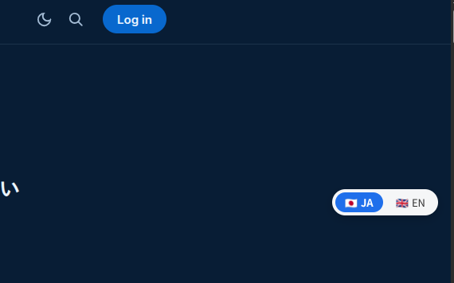
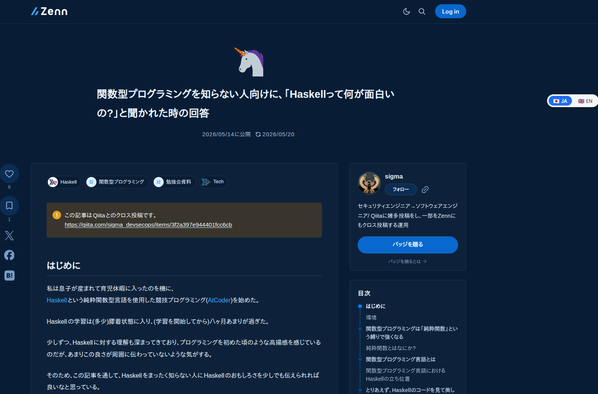
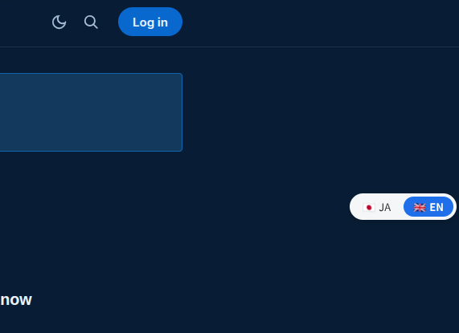
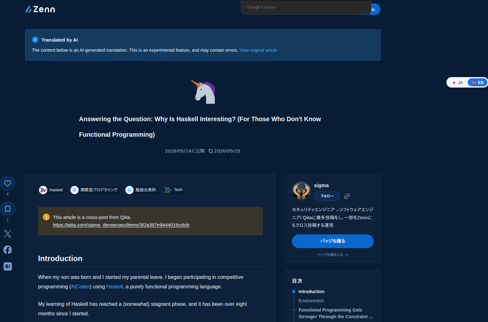

# zenn_ja_en_switcher

## INDEX

- [ABOUT](#about)
- [ENVIRONMENT](#environment)
- [HOW TO USE](#how-to-use)
- [For Developer](#for-developer)

## ABOUT

Zenn の記事ページに `🇯🇵 JA` / `🇬🇧 EN` のフロート式トグルボタンを差し込み、ワンクリックで `?locale=en` の付け外しをするブラウザ拡張機能。

Zennは翻訳機能をオンにしている場合、英語記事が自動生成される。
だが、記事の執筆者が翻訳されたページを確認するためには、URLに`?locale=en`を付ける必要がある。
本拡張機能は、UI 上に切り替えスイッチを提供し、記事投稿者の翻訳確認などを楽にする。


1. Zenn の記事ページを開くと、右下に `🇯🇵 JA` / `🇬🇧 EN` のトグルボタンが表示される (初期状態は JA)。

   

   

2. `EN` をクリックすると `?locale=en` が付与され、AI 翻訳された英語版に切り替わる。

   

   

---

## ENVIRONMENT

| | |
| --- | --- |
| 拡張フレームワーク | [WXT](https://wxt.dev/) (Manifest V3, Chrome/Firefox 両対応) |
| UI | React 19 + TypeScript |
| 注入方式 | Content Script + Shadow Root UI (Zenn 側 CSS と非干渉) |
| パッケージ管理 | bun |
| 開発環境 | nix-flake (`bun`, `nodejs_22`) |

---

## HOW TO USE

### 前提

<https://zenn.dev/settings/account> により、該当ユーザが**記事の英語版の生成を有効にする**をオンにしていること

### install from release

#### Chrome / Edge

1. [最新のRelease](https://github.com/RyosukeDTomita/zenn_ja_en_switcher/releases)から `*-chrome.zip` をダウンロードする。
2. ダウンロードした zip を任意のディレクトリに解凍する。
3. `chrome://extensions` を開き、右上の「デベロッパーモード」を ON にする。
4. 「パッケージ化されていない拡張機能を読み込む」をクリックし、解凍したフォルダを選択する。

> [!NOTE]
> Chrome は zip を直接インストールできないため、解凍してフォルダを読み込む。

#### Firefox

1. [最新のRelease](https://github.com/RyosukeDTomita/zenn_ja_en_switcher/releases)から `*-firefox.zip` をダウンロードする。
2. `about:debugging#/runtime/this-firefox` を開く。
3. 「一時的なアドオンを読み込む」をクリックし、ダウンロードした zip を選択する。
   (一時インストールのため、Firefox を再起動すると消える)

> [!WARNING]
> 通常版 Firefox は署名 (AMO) のない zip の恒久インストールを拒否する。
> 一時インストールでのみ未署名 zip を読み込める。


### build yourself

#### Chrome / Edge

1. `bun run build` を実行
2. `chrome://extensions` を開き、右上の「デベロッパーモード」を ON
3. 「パッケージ化されていない拡張機能を読み込む」をクリックし、`.output/chrome-mv3/` ディレクトリを選択

#### Firefox

1. `bun run build:firefox` を実行
2. `about:debugging#/runtime/this-firefox` を開く
3. 「一時的なアドオンを読み込む」から `.output/firefox-mv2/manifest.json` を選択
   (一時インストールのため、Firefox を再起動すると消える)

> [!WARNING]
> `about:addons` の「ファイルからアドオンをインストール」からは読み込めない。
> こちらは `.xpi` / `.zip` パッケージを要求するため、`manifest.json` 単体を指定するとロード失敗になる。

---

## For Developer

### install dependencis

```sh
nix develop
bun install
```

### try to run

開発モードでは WXT がブラウザを自動起動し、拡張機能を読み込んだ状態で立ち上げる。
コードを保存すると HMR で content script がリロードされる。

```shell
# 自分の環境では必要だった。
sudo sysctl fs.inotify.max_user_watches=524288 fs.inotify.max_user_instances=512
```

```sh
# Chrome 用 dev (HMR 付きで Chrome が起動)
bun run dev

# Firefox 用 dev
bun run dev:firefox
```

動作確認には Zenn の任意の記事ページを開く。例:

- <https://zenn.dev/sigma_tom/articles/haskell-functional-programming-intro>

> [!NOTE]
> Extensionsが表示されない場合にはリロードすると表示されることがある。

### build

```sh
# Chrome MV3 用に .output/chrome-mv3/ を生成
bun run build

# Firefox 用ビルド
bun run build:firefox

# ストア提出用の zip を生成
bun run zip
bun run zip:firefox
```

ビルド成果物は `.output/` 配下に出力される。

### debug with Claude Code using chrome-devtools-mcp

content script が実際の Zenn ページで動くかを [chrome-devtools-mcp](https://github.com/ChromeDevTools/chrome-devtools-mcp) 経由で検証できる。

- 要点は、ユーザーが手動ロードした実 Chrome に `--browserUrl` で remote-debugging 接続すること
  - (MCP が新規起動する Chrome には拡張が入らないため)。
  - 専用 `--user-data-dir` で Chrome を起動し、`chrome://extensions` から `.output/chrome-mv3/` を手動ロードする。

詳細な手順は `.claude/skills/debug-extension/SKILL.md` を参照。

